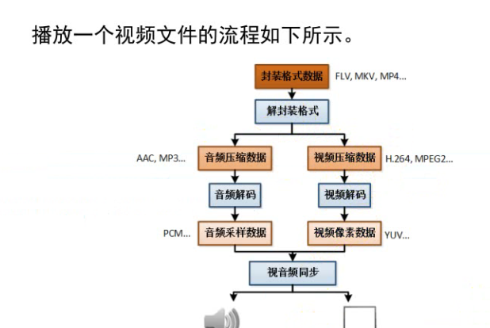

yuv: y 代表亮度，u,v 代表色度。

采样率：44100 ，1秒钟有这么多采样点。肉体能察觉的最大值。

工具：

 MediaInfo 查看视频信息。

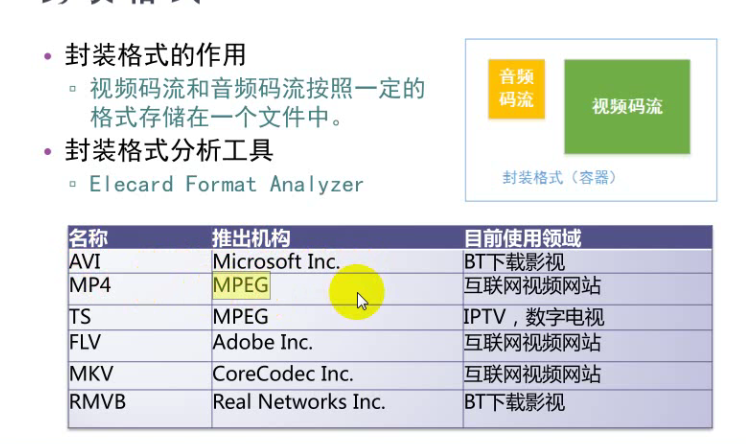

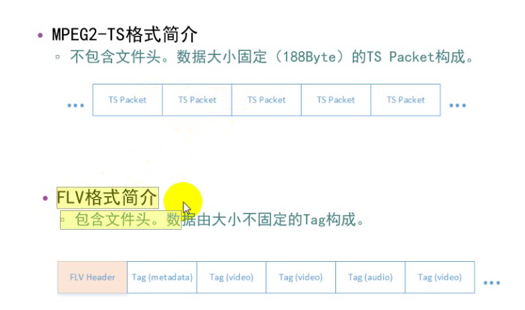

 想让一个视频文件快进：

会发现 让flv 快进是不行的，mp4 是可以的。

mp4 文件可以通过暴风影音按住方向键快进，flv就不行。迅雷看看做了额外的处理，可以快进。

关键在于，mp4 是一个一个独立的，数据大小固定的数据包 packet .

flv:在做推流的时候，先发了一个头，flv header ,metadata ,然后接着是视频，音频。间隔的。

数据由大小不固定的构成。

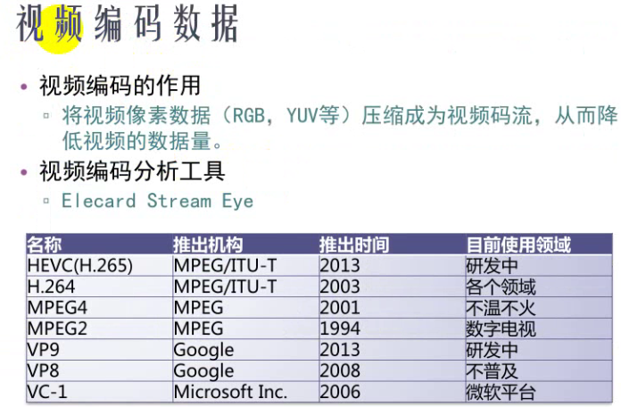

音频编码

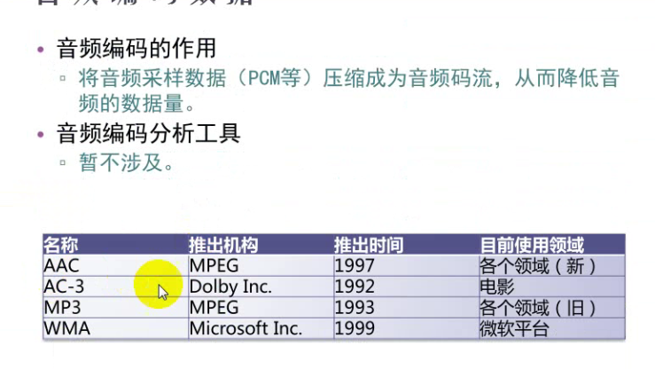

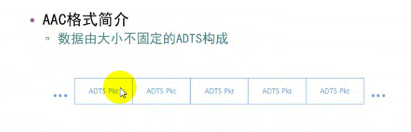

视频像素数据

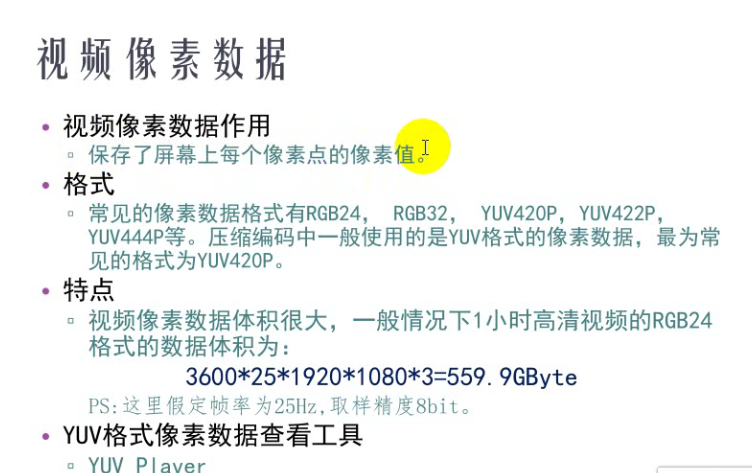

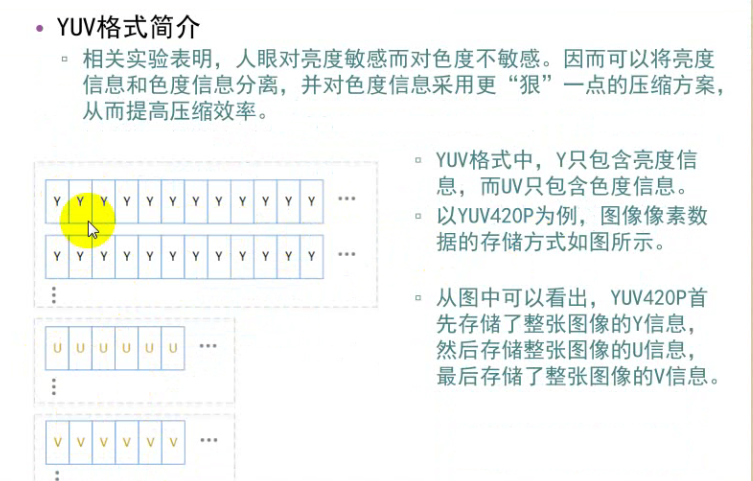

 yuv :

 **u和v是 y的四分之一**

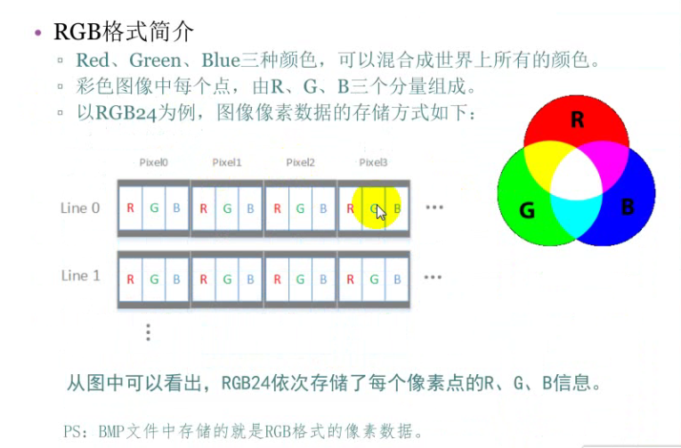

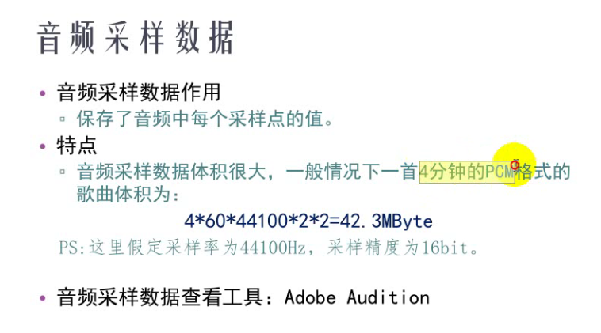

ffmpeg:

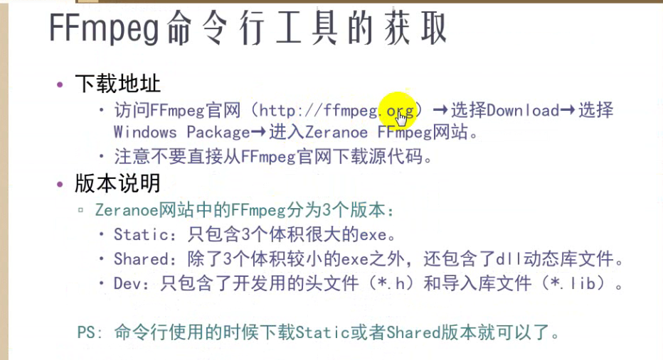

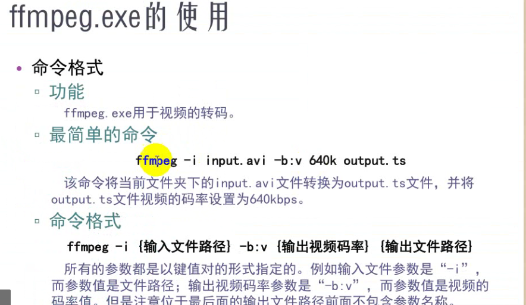

**码率：每一帧画面的大小。** 

单位时间播放连续的媒体 如压缩后的音频或者视频的比特数量。正常来说，码率越高，清晰度越高。

例如：

转码

ffmpeg -i input.mp4 output.avi

得到视频的gif 文件

ffmpeg -ss 2 -t 5 -i input.mp4 -s 640x360 -b:v 1500k output.gif

从第2s开始，录制5s

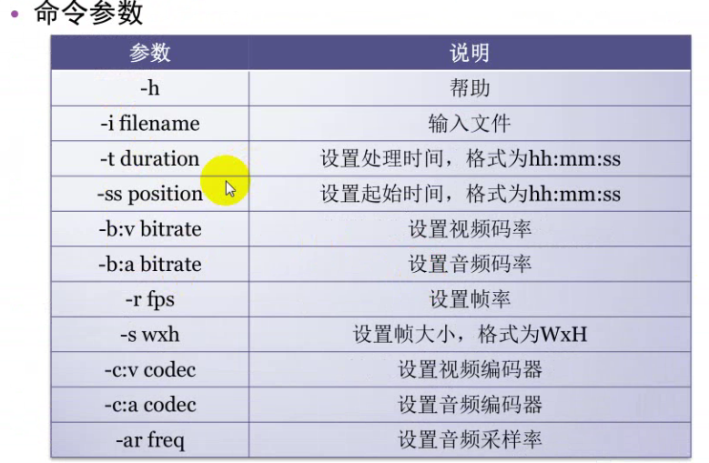

ffplay.exe 使用

