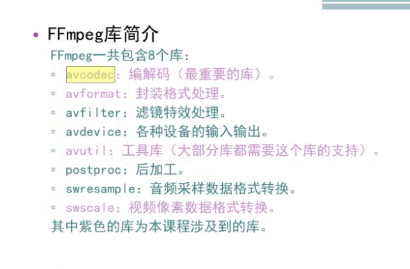
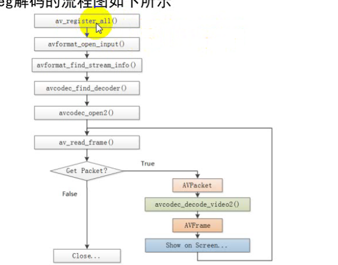
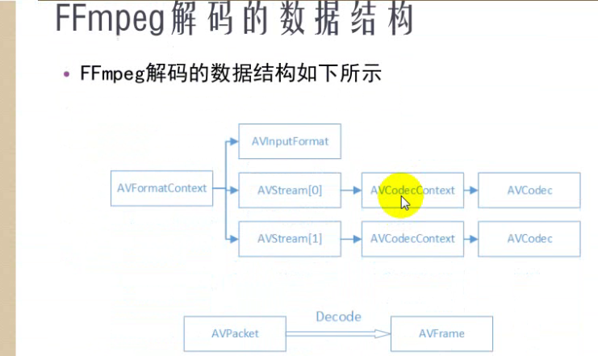

解码流程







**native 绘制：**

1，lock windows

2, 缓冲区赋值

3，unlock window


surfaceView 画布，要把视频画面绘制到surfaceView 上去，surfaceView 是可以设置输出格式的。


```
SurfaceHolder holder =getHolder(); ///初始化绘制像素格式
holder.setFormat(PixelForat.RGBA_8888); //RGBA_8888这个色彩丰富，内存也大


Surface surface = surfaceiew.getHodler().getSurface();
```


像素格式
像素格式的知识此前已经记录过，不再重复。在这里记录一下FFmpeg支持的像素格式。有几点注意事项：
（1）       所有的像素格式的名称都是以“AV_PIX_FMT_”开头
（2）       像素格式名称后面有“P”的，代表是planar格式，否则就是packed格式。Planar格式不同的分量分别存储在不同的数组中，例如AV_PIX_FMT_YUV420P存储方式如下：

data[0]: Y1, Y2, Y3, Y4, Y5, Y6, Y7, Y8……
data[1]: U1, U2, U3, U4……
data[2]: V1, V2, V3, V4……

Packed格式的数据都存储在同一个数组中，例如AV_PIX_FMT_RGB24存储方式如下：

data[0]: R1, G1, B1, R2, G2, B2, R3, G3, B3, R4, G4, B4……
————————————————
版权声明：本文为CSDN博主「雷霄骅」的原创文章，遵循 CC 4.0 BY-SA 版权协议，转载请附上原文出处链接及本声明。
原文链接：https://blog.csdn.net/leixiaohua1020/article/details/42134965


